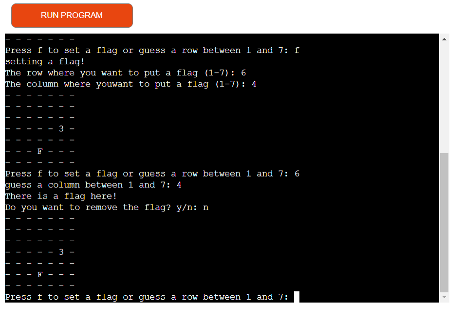

# Minesweeper

Minesweeper is a logic puzzle video game genre generally played on personal computers. The game features a grid of clickable squares, with hidden "mines" scattered throughout the board. The objective is to clear the board without detonating any mines, with help from clues about the number of neighboring mines in each field.

<a href="https://minesweeper-portfolio-project3.herokuapp.com/" target="_blank">heres a life version of the game</a>

 

## How to play

In this version the user can choose how many mines they want. When choosing a number between 5 and 15 the user gets asked if they want to put a flag somewhere or put a number between 1 and 7 for the row they want to choose. after choosing a row the user gets to choose the column. When choosing to set a flag the user also gets to choose the column and row they want to put the flag. If the user puts in coordinates where there is a flag (F), they get asked if they want to remove the flag. An empty cell is indicated by a **-** sign. a flag is indicated by the letter **F**. And opened cells have a number that indicates how many mines are around that cell. If the player wins by opening all the cells with no mines, or if the user hits a mine the user can choose if they want to play again or not. And terminal shows the solution with mines indicated by a <strong>*</strong> .

 

## Features

### Existing features

- Random mine generator
    - The user chooses how many mines they want and they get placed randomly.
    - The user can't see where the mines are only on the end of the game.

- User input gets caculated how many mines there are around that cell.

- flag input if the user thinks there is a flag there.
    - if the user accidentally puts in coordinates where there is a flag the cell doesnt open.
    - the user can remove the flag though when putting in the coordinates of a flag and entering **y** to the question.

- Input validation and error checking.
    - row and columns only numbers inside the size of the grid or the letter f for flag gets accepted.
    - other questions get answered by y or n (yes or no).
    - value error for wrong inputs.

 

### future features

- Add a function that if the user hits a zero the cells around it get opened automatically.

 

## Testing

### Validator testing

- pep8
    - No errors only warnings were found when passing through the <a href="https://pep8ci.herokuapp.com/#" target="_blank"> Code Institute Python Linter </a>.

 

### Manual testing

I have manualy tested the program by doing the following:

- Given Invalid input: strings when numbers where expected, numbers when strings where expected, out of bounds input.

- Set a flag, put in the coordinates of that flag, remove the flag, open the cell where the flag was.

- With show solution on:
    - Open a cell next to one mine to see if number will be 1. do the same with 2,3 etc.
    - Lose game, On purpose hit a mine and see if endgame function gets called. put in 'y' for play again and 'n'.
    - set max number of mines to 47, open the 2 empty spaces left and see if win game function gets called.

 

## Bugs

 

### Solved bugs

#### Problem

1. At the end of the game when the user chose to play again the grids would not reset. The number of mines would also add up.
2. If the user put a flag somewhere at the end of the game the user would get asked to put in a column, even when choosing the n for not playing again.
3. Win game function would not activate.
4. And some small bugs that were easily fixible

### Solution

1. Add global variables of both grids to endgame function so they both reset to normal.
2. Split the function of asking the row and column into 2. The first question stayed the same for user experience so there doesn't need to be an extra question asking to open a cell or put a flag
3. Make opened_cell variable global (took me some time to fix this simple problem)

### Remaining bugs

- No bugs remaining

 

## Deployment

This project was deployed using Code Institute's mock terminal for Heroku.

- Steps for deployment:
    1. Fork or clone this repository
    2. Create a new Heroku app
    3. Set the buildpacks to Python and NodeJS in that order
    4. Link the Heroku app to the repository
    5. Click on deploy

 

## Credits

- Code Institute for the deployment terminal
- For the check_around function used an own version of the code in <a href='https://www.youtube.com/watch?v=lla6QlAF4HQ' target="_blank"> this youtube video </a>.
- For the show_grid function and show_solution function i copied and pasted the code found in <a href='https://www.youtube.com/watch?v=XTT8mXwIGpQ' target="_blank"> this youtube video </a>. Here is also the code in <a href="https://github.com/wynand1004/Projects/blob/master/Minesweeper/minesweeper.py" target="_blank"> Github </a>
- The Love Sandwiches walkthrough project, for the value error.